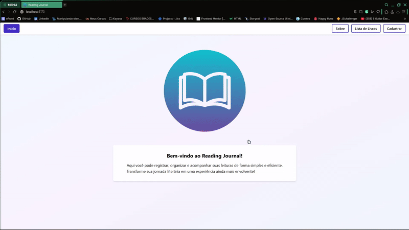
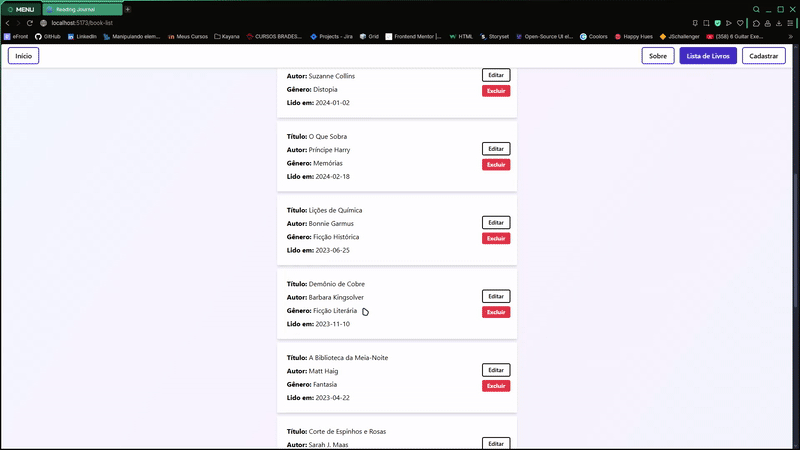

## Nome: `Enzo Cezar Garcia Rocha`

Para executar este projeto:

1. Entre na pasta reading-journal no terminal:

```
cd reading-journal
```

2. Rode npm install para instalar as dependências do projeto:

```
npm install
```

3. E em seguida, npm start, para iniciar a execução do projeto.

```
npm run dev
```

4. Por último, abra o link que vai estar sendo exibido no terminal, será algo como:

```
  VITE v6.3.5  ready in 271 ms

  ➜  Local:   http://localhost:5173/
  ➜  Network: use --host to expose
  ➜  press h + enter to show help
```

<div align="center">

  

</div>

## Introdução

Este projeto foi desenvolvido para a disciplina de Desenvolvimento de Sistemas Frontend do curso de Análise e Desenvolvimento de Sistemas da PUCRS. Foi desenvolvido utilizando ReactJS e TailwindCSS. Em sua primeira fase, a aplicação explora o CRUD de um Reading Journal possibilitando adicionar, editar e remover livros de uma lista.

## Componentes

Os componentes estão no diretório `./src/components` e eles possuem as seguintes características:

- About:

  - Descrição: este componente é uma página simples com informativos à respeito do projeto.

- BookForm:

  - `props`
    - label: um parâmetro que define o texto exibido no botão do BookForm, caso haja necessidade de alterar de 'Cadastrar' para 'Salvar Alterações', por exemplo;
    - onFormSubmit: referência para chamar o método handleAddBook - adiciona livros na base de dados através de uma chamada POST do Axios;
  - Descrição: este componente é utilizado para cadastrar livros através de um `<form>` e se encontra na página "Cadastrar".

- BookList:

  - `props`
    - books: contém os dados provenientes da API - que foram recuperados através de um método GET dentro de um UseEffect();
    - onDelete: referência para chamar o método handleDeleteBook do seu componente pai que exclui livros através de uma chamada do método DELETE da API;
    - onUpdate: referência para chamar o método handleUpdateBook do seu componente pai que edita um livro através de uma chamada do método PUT da API;
  - Descrição: este componente exibe a lista de livros cadastrados, assim como o formulário para edição deles quando for ativado pelo botão `Editar`.

<div align="center">

  

</div>

- Home:

  - Descrição: este componente é uma home page simples que contém apenas uma mensagem de boas-vindas. É a página inicial da aplicação.

- NavBar:
  - `props`
    - navLinks: é utilizado para passar o array `routes` com a definição das rotas utilizadas para navegação na aplicação;
  - Descrição: este componente utiliza Link do React Router para mostrar as páginas disponíveis em uma barra de navegação.

## Testes

Foram implementados testes unitários - nos métodos POST e DELETE da API - utilizando Jest, configurado com Babel - arquivo ``babel.config.js`` encontrado na raiz do projeto - para poder interpretar ESModules.
- Para rodar os testes basta utilizar o comando:
```
npm run test
```
- A resposta esperada é algo como:
```
> reading-journal-fase-1@0.0.0 test
> jest

 PASS  __tests__/books.test.js
  addBook
    √ deve criar um novo livro e retornar os dados criados (6 ms)
  deleteBook                                                                                                                                                                                            
    √ deve chamar a API para deletar um livro com o ID correto e retornar a mensagem de sucesso (1 ms)                                                                                 

Test Suites: 1 passed, 1 total                             
Tests:       2 passed, 2 total                                                      
Snapshots:   0 total
Time:        1.48 s, estimated 2 s
Ran all test suites.
```

## Conclusão

Este projeto foi desenvolvido por Enzo Cezar Garcia Rocha para fins educacionais e é uma atividade avaliativa da disciplina de Desenvolvimento de Sistemas Frontend da Pontifícia Universidade Católica do Rio Grande do Sul.
